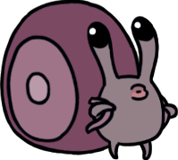
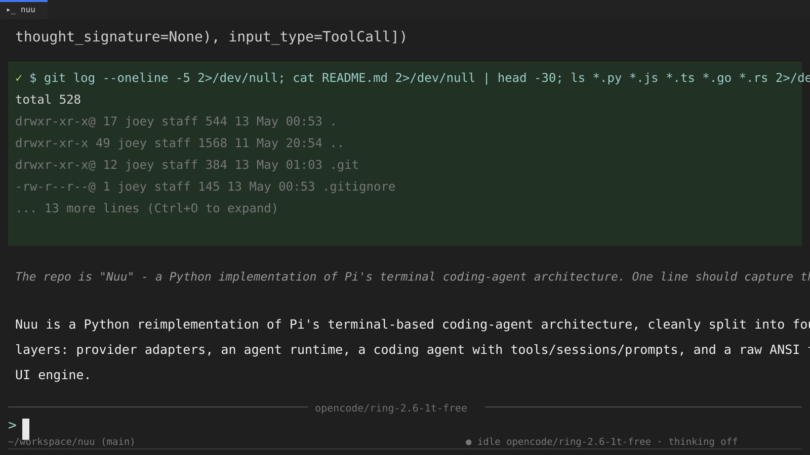

<p align="center">
  
</p>

# Nuu

Nuu is a Python implementation of Pi's terminal coding-agent architecture. It is
inspired by [Pi](https://github.com/earendil-works/pi), and is an attempt to
make Pi in Python while keeping the same clean split between provider APIs,
agent runtime, coding-agent behavior, and terminal UI.

Nuu is organized as four separable layers:

- `nuu.ai` - provider adapters, model metadata, credentials, and normalized
  assistant streaming events.
- `nuu.agent` - stateful agent runtime, event lifecycle, tool execution,
  steering messages, and follow-ups.
- `nuu.coding_agent` - tools, sessions, prompts, slash commands, settings, and
  CLI behavior.
- `nuu.tui` - raw ANSI terminal engine, editor, widgets, keybindings, overlays,
  and differential rendering.

<p align="center">
  
</p>

## Table of Contents

- [Quick Start](#quick-start)
- [Providers And Models](#providers-and-models)
- [Interactive Mode](#interactive-mode)
  - [Editor](#editor)
  - [Slash Commands](#slash-commands)
  - [Keyboard Shortcuts](#keyboard-shortcuts)
  - [Message Queue](#message-queue)
- [Sessions](#sessions)
- [Settings](#settings)
- [Context And Prompts](#context-and-prompts)
- [Tools](#tools)
- [Architecture](#architecture)
- [Programmatic Use](#programmatic-use)
- [Development](#development)
- [CLI Reference](#cli-reference)
- [Third-Party Notices](#third-party-notices)
- [License](#license)

## Quick Start

Install dependencies:

```bash
uv sync
```

Run Nuu in the current project:

```bash
uv run nuu
```

Authenticate with an API key:

```bash
export ANTHROPIC_API_KEY=sk-ant-...
uv run nuu
```

Or open the authentication flow inside the TUI:

```text
/login
```

Run a non-interactive prompt:

```bash
uv run nuu "summarize this repository"
```

Run with a specific provider and model:

```bash
uv run nuu --provider anthropic --model claude-sonnet-4-20250514
```

Nuu starts with built-in coding tools for listing, reading, writing, editing,
searching, and running shell commands.

## Providers And Models

Nuu keeps model metadata in `nuu/ai/models.json` and resolves models through
`nuu/coding_agent/core/model_resolver.py`. Provider display names live in
`nuu/coding_agent/core/provider_display_names.py`.

Built-in provider names include:

- Amazon Bedrock
- Anthropic
- Azure OpenAI Responses
- Cerebras
- Cloudflare AI Gateway
- Cloudflare Workers AI
- DeepSeek
- Fireworks
- GitHub Copilot
- Google Gemini
- Google Vertex AI
- Groq
- Hugging Face
- Kimi Coding
- MiniMax
- Mistral
- Moonshot AI
- OpenAI
- OpenAI Codex
- OpenCode
- OpenRouter
- Vercel AI Gateway
- xAI
- Xiaomi
- ZAI

Model selection examples:

```bash
uv run nuu --provider openai --model gpt-4o
uv run nuu --provider anthropic --model claude-sonnet-4-20250514
uv run nuu --tui --provider anthropic --model claude-sonnet-4-20250514
```

The interactive TUI also has `/model` and `/scoped-models` for changing model
selection during a session.

API key environment variables include:

| Variable | Provider |
|---|---|
| `ANTHROPIC_API_KEY` | Anthropic |
| `OPENAI_API_KEY` | OpenAI |
| `GEMINI_API_KEY` | Google Gemini |
| `MISTRAL_API_KEY` | Mistral |
| `AWS_ACCESS_KEY_ID`, `AWS_SECRET_ACCESS_KEY`, `AWS_REGION`, `AWS_PROFILE` | Amazon Bedrock |
| `AZURE_OPENAI_API_KEY`, `AZURE_OPENAI_BASE_URL`, `AZURE_OPENAI_API_VERSION` | Azure OpenAI |
| `CLOUDFLARE_API_KEY`, `CLOUDFLARE_ACCOUNT_ID` | Cloudflare |
| `OPENROUTER_API_KEY` | OpenRouter |
| `HF_TOKEN` | Hugging Face |

See [docs/ai.md](docs/ai.md) for provider-layer internals.

## Interactive Mode

Interactive mode is the default:

```bash
uv run nuu
```

The terminal UI is custom. It does not use Textual. Rendering is direct ANSI
output with differential updates.

Main areas:

- Messages: user prompts, assistant responses, thinking blocks, tool calls,
  tool results, system messages, and errors.
- Editor: multi-line input at the bottom of the screen.
- Footer: working state, model/session context, and status information.
- Overlays: model picker, login picker, API key input, auth type selector, and
  slash picker.

### Editor

| Feature | How |
|---|---|
| Submit prompt | Enter |
| Insert newline | Shift+Enter, Ctrl+J, or Alt+Enter |
| Tab/autocomplete | Tab |
| Move by character | Arrow keys, Ctrl+B, Ctrl+F |
| Move by word | Alt+Left, Ctrl+Left, Alt+B, Alt+Right, Ctrl+Right, Alt+F |
| Move to line start/end | Home, End, Ctrl+A, Ctrl+E |
| Delete backward/forward | Backspace, Delete, Ctrl+D |
| Delete word | Ctrl+W, Alt+Backspace, Alt+D, Alt+Delete |
| Delete to line start/end | Ctrl+U, Ctrl+K |
| Undo | Ctrl+- |

### Slash Commands

Type `/` in the editor to open the slash picker.

| Command | Description |
|---|---|
| `/settings` | Open settings menu |
| `/model` | Select model |
| `/scoped-models` | Enable or disable models for cycling |
| `/login`, `/logout` | Configure or remove provider authentication |
| `/new` | Start a new session |
| `/resume` | Resume a different session |
| `/session` | Show session information |
| `/tree` | Navigate the session tree |
| `/fork` | Fork from a previous user message |
| `/clone` | Duplicate the current session |
| `/compact` | Manually compact context |
| `/export`, `/import`, `/share` | Move or publish session data |
| `/copy` | Copy the last agent message |
| `/name` | Set session display name |
| `/hotkeys` | Show keyboard shortcuts |
| `/changelog` | Show changelog entries |
| `/reload` | Reload keybindings, extensions, skills, prompts, and themes |
| `/debug` | Print debug information |
| `/quit` | Quit Nuu |

Slash command metadata is in `nuu/coding_agent/slash_commands.py`. Dispatch is
handled in `nuu/tui/app.py`.

### Keyboard Shortcuts

Common app-level shortcuts:

| Key | Action |
|---|---|
| Ctrl+C | Abort while busy; when idle, clear editor; press twice quickly to quit |
| Escape | Close overlay; abort while busy; do nothing when idle |
| Ctrl+P | Cycle to next scoped model |
| Shift+Ctrl+P | Cycle to previous scoped model |
| Alt+Up / Alt+Down | Reorder models in scoped model UI |
| Ctrl+O | Expand or collapse last tool output |
| Shift+Tab | Cycle thinking level |
| Ctrl+T | Toggle thinking block visibility |

All keybindings are defined in `nuu/tui/engine/keybindings.py`. Application code
must match keys through the keybinding manager, not by hardcoded escape
sequences.

### Message Queue

The agent runtime supports two queues:

- Steering messages: delivered after the current assistant turn and tool calls
  finish.
- Follow-up messages: delivered when the agent has no remaining tool calls and
  no steering messages.

Queue modes are `one-at-a-time` or `all`. See [docs/agent.md](docs/agent.md)
for the runtime contract.

## Sessions

Sessions are stored as JSONL under `~/.nuu/sessions/<cwd>/`.

Session-related slash commands:

| Command | Description |
|---|---|
| `/new` | Start a new session |
| `/resume` | Resume a different session |
| `/session` | Show session information |
| `/tree` | Navigate the session tree |
| `/fork` | Fork from a previous user message |
| `/clone` | Duplicate the current session |
| `/compact` | Manually compact context |
| `/export` | Export session data |
| `/import` | Import session data |

Session files start with a header:

```json
{"type":"session","version":3,"id":"...","timestamp":"...","cwd":"...","parentSession":null}
```

Later lines are typed entries:

- `SessionMessageEntry`
- `ThinkingLevelChangeEntry`
- `ModelChangeEntry`
- `CompactionEntry`

`SessionManager.build_session_context()` replays the JSONL file to reconstruct
agent state. See [docs/coding_agent.md](docs/coding_agent.md) for details.

## Settings

Global settings are stored under the Nuu agent directory. By default this is
`~/.nuu`, or the platform user data directory when `platformdirs` is available.
Override it with:

```bash
export NUU_AGENT_DIR=/path/to/nuu-data
```

Project settings can be placed in:

```text
.nuu/settings.json
```

Settings are Pydantic-typed and loaded through
`nuu/coding_agent/core/settings_manager.py`. Do not read or write settings files
directly from feature code.

Useful environment variables:

| Variable | Description |
|---|---|
| `NUU_AGENT_DIR` | Config/data directory |
| `NUU_OFFLINE` | Disable startup network operations |

## Context And Prompts

Nuu assembles the system prompt from:

- base coding-agent instructions
- selected tool descriptions
- prompt guidelines
- project context files
- skills
- `AGENTS.md` content
- custom prompt values passed by the coding-agent runtime
- appended system prompt values passed by the coding-agent runtime

## Tools

Built-in tools are created in `nuu/coding_agent/tools/index.py`.

| Tool | Purpose |
|---|---|
| `ls` | List directory contents |
| `read` | Read file contents |
| `write` | Write files |
| `bash` | Run shell commands |
| `edit` | Edit existing files |
| `find` | Find files by path/name |
| `grep` | Search file contents |

To add a tool:

1. Create `nuu/coding_agent/tools/<name>.py`.
2. Implement `AgentTool` from `nuu.agent.types`.
3. Add an instance to `create_all_tools()`.
4. Add tests under `tests/coding_agent/tools/`.

See [docs/coding_agent.md](docs/coding_agent.md) and
[docs/agent.md](docs/agent.md).

## Architecture

The package layout mirrors Pi's separation of concerns:

```text
nuu/ai/
  Provider adapters and normalized LLM streaming.

nuu/agent/
  Runtime loop, stateful facade, tool execution, and event stream.

nuu/coding_agent/
  CLI, tools, sessions, settings, prompts, skills, and app wiring.

nuu/tui/
  Raw terminal engine, widgets, editor, keybindings, and rendering.
```

Lower layers do not import upward. Put new behavior in the lowest layer that can
own it cleanly.

Documentation:

- [docs/index.md](docs/index.md)
- [docs/ai.md](docs/ai.md)
- [docs/agent.md](docs/agent.md)
- [docs/coding_agent.md](docs/coding_agent.md)
- [docs/tui.md](docs/tui.md)

## Programmatic Use

Use `nuu.agent.Agent` directly when you want the runtime without the terminal
coding-agent UI:

```python
from __future__ import annotations

from nuu.agent.agent import Agent
from nuu.ai.models import get_model


model = get_model("anthropic", "claude-sonnet-4-20250514")
if model is None:
    raise RuntimeError("Model is not registered")

agent = Agent(
    initial_state={
        "system_prompt": "You are concise.",
        "model": model,
        "tools": [],
        "messages": [],
    },
)

await agent.prompt("Explain the current architecture.")
```

The lower-level loop is available through `nuu.agent.agent_loop.run_agent_loop()`.

## Development

Run the standard checks:

```bash
uv run ruff check .
uv run mypy
uv run pytest
```

Common development commands:

| Task | Command |
|---|---|
| Sync environment | `uv sync` |
| Run CLI | `uv run nuu` |
| Run module | `uv run python -m nuu` |
| Lint | `uv run ruff check .` |
| Format | `uv run ruff format .` |
| Type check | `uv run mypy` |
| Test all | `uv run pytest` |
| Test one file | `uv run pytest tests/path/to/test_file.py` |

TUI smoke test with tmux:

```bash
tmux new-session -d -s nuu-test -x 220 -y 50
tmux send-keys -t nuu-test "cd /Users/joey/workspace/nuu && uv run nuu" Enter
sleep 2 && tmux capture-pane -t nuu-test -p
tmux kill-session -t nuu-test
```

After code changes, run `uv run ruff check .` and `uv run mypy`. If tests are
added or modified, run the relevant tests before handing off.

## CLI Reference

```bash
nuu [--model MODEL] [--provider PROVIDER] [--tui] [prompt]
```

The package entrypoint is intentionally small today. When no prompt is supplied,
Nuu starts the TUI. When a prompt is supplied, Nuu runs the coding-agent prompt
path and exits after the response.

| Option | Description |
|---|---|
| `prompt` | Initial prompt. Omit for TUI mode |
| `--model <model>` | Model ID |
| `--provider <provider>` | Provider ID |
| `--tui` | Force TUI mode even when a prompt is provided |
| `-h`, `--help` | Show help |

### Examples

```bash
# Interactive with an initial prompt
uv run nuu "list the important files"

# Start the TUI
uv run nuu

# Use a specific model
uv run nuu --provider openai --model gpt-4o "help me refactor"

# Force TUI with a selected model
uv run nuu --tui --provider anthropic --model claude-sonnet-4-20250514
```

## Third-Party Notices

Third-party licenses and notices are kept under [third_party/](third_party/).

- [Pi license](third_party/pi/LICENSE)
- [Nuu image notice](third_party/hollow-knight-silksong/NOTICE.md)

The README image references Nuu from Hollow Knight: Silksong. The character and
game artwork belong to Team Cherry.

## License

MIT. See [LICENSE](LICENSE).
